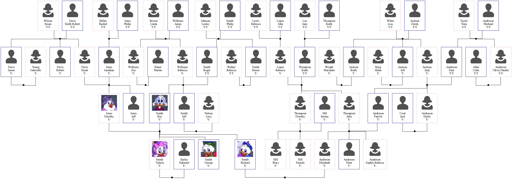

= ged2dot, a GEDCOM to Graphviz converter

image:https://github.com/vmiklos/ged2dot/workflows/tests/badge.svg["Build Status", link="https://github.com/vmiklos/ged2dot/actions"]
image:https://tokei.rs/b1/github/vmiklos/ged2dot?category=code["LoC"]

The latest version is v7.0, released on 2020-08-18.  See the
https://github.com/vmiklos/ged2dot/blob/master/NEWS.adoc[release notes].

== What's the problem the tool solves?

`ged2dot` is a script that takes a http://en.wikipedia.org/wiki/GEDCOM[GEDCOM] file and tries to
visualize it using http://www.graphviz.org/[Graphviz]'s `dot` tool. The basic idea is that you can
map individuals and families to graph nodes and connections between them to graph edges, then `dot`
takes care of the rest. What's unique about `ged2dot` is that it allows more than showing ancestors
and descendants of a single individual (what you can easily do with random family editor software).

You usually want to customize your input filename, output filenames, the root family and the depth
of the graph visitor. You can provide these either by using command-line arguments (see `ged2dot.py
--help`) or by using a configuration file (see `ged2dotrc.sample`). When using both, the
command-line arguments overwrite configuration values.

== Layout

The layout does a Breadth First Search (BFS) traversal on the graph, from the starting family:

This has several benefits over explicitly trying to guess which family belongs to which generation.
Some example more tricky cases, which are handled by `ged2dot`:

- root family -> husband -> sister -> showing her kids

- root family -> wife -> cousin -> showing her kid

- root family -> husband -> grand father -> showing both wives with the matching kids

- marrying cousins

(ged2dot <= 7.0 allowed multiple layouts, none of them supported the above more tricky cases.)

== Qt-based GUI

The `qged2dot.py` script is a Qt-based GUI for `ged2dot`, which can turn the `dot` output into PNG
files.

For macOS:

- The DMG is not signed digitally, so you need to allow its usage
  https://support.apple.com/guide/mac-help/open-a-mac-app-from-an-unidentified-developer-mh40616/mac[explicitly].

- You need to install https://brew.sh/[brew], then `dot` itself with `brew install graphviz`.

For Windows:

- You need to install https://chocolatey.org/[choco], then `dot` itself with `choco install
  graphviz`.

The app icon is by https://icon-icons.com/icon/family-tree/120659[Appzgear].

== LibreOffice Draw GEDCOM import filter

The `libreoffice/` subdirectory contains a LibreOffice extension, that
implements a GEDCOM import filter for Draw. Needless to say, it uses `ged2dot`
internally -- think of it as a GUI for `ged2dot`, with the additional benefit
that you can hand-edit the resulting layout in Draw, if you want.

Its dependencies:

- It uses Graphviz to process the `dot` format. In case you don't have Graphviz
  installed:

  * For Windows,
    https://graphviz.gitlab.io/_pages/Download/Download_windows.html[get it here] (2.38 is tested).

  * For Linux, use your package manager to install the `graphviz` package (2.28 is tested).

  * For macOS, install it from https://brew.sh/[brew] (2.36 is tested).

- LibreOffice >= 6.1

Features:

- Filter detection: you can use File -> Open and select a GEDCOM file, and
  it'll be opened in Draw automatically.
- Import options: On import, a graphical dialog can be used to set a subset of
  the options available in a `ged2dotrc`.
- Internally reuses the excellent SVG import filter of LibreOffice, contributed
  by Fridrich Strba and Thorsten Behrens, so the result can be manually
  fine-tuned if necessary.
- Runs on Windows and Linux and macOS.

You can grap a release binary at the
http://extensions.libreoffice.org/extension-center/gedcom[LibreOffice
Extensions] site -- more on how to to install a LibreOffice extension
https://wiki.documentfoundation.org/Documentation/HowTo/install_extension[here].

Once that's done, you'll see something like this if you open a GEDCOM file:

image::libreoffice/screenshot.png[]

== Bugs

For `ged2dot`, in case a given input results in a runtime crash, it's
considered a bug. If you have a fix for it,
https://github.com/vmiklos/ged2dot/pull/new/master[pull requests] on GitHub are
welcome. Make sure to run `make check` before submitting your changes.

For the LibreOffice extension, in case you get an error during opening:

- For Windows, the log file location is something like:

----
C:/Users/John/Application Data/LibreOffice/4/user/Scripts/python/log.txt
----

- For Linux, start LibreOffice from a terminal, the log is printed to the
  standard error.

- For Mac, start LibreOffice from Terminal:

----
cd /Applications/LibreOffice.app/Contents/program
./soffice --nologo /path/to/test.ged
----

then the log is printed to the standard error as well.

== Icons

Icons are from
http://www.wpzoom.com/wpzoom/new-freebie-wpzoom-developer-icon-set-154-free-icons/[WPZOOM],
in case placeholders have to be used for missing images.

== Resources

- https://www.familysearch.org/developers/docs/guides/gedcom[GEDCOM specification]

== Download

From https://github.com/vmiklos/ged2dot[GitHub].
