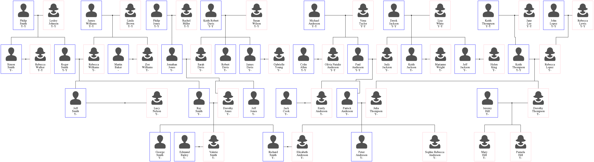
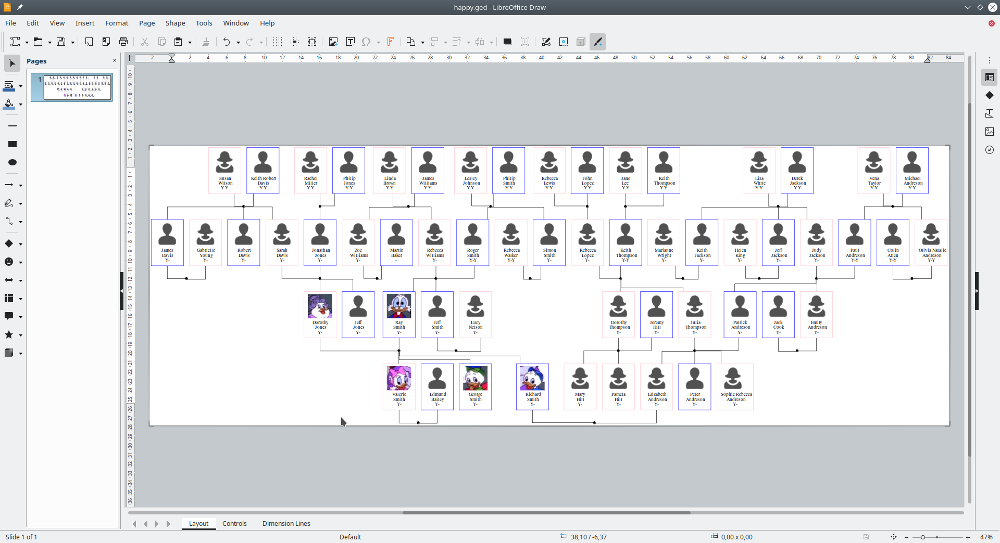

= ged2dot, a GEDCOM to Graphviz converter

image:https://travis-ci.org/vmiklos/ged2dot.svg?branch=master["Build Status", link="https://travis-ci.org/vmiklos/ged2dot"]
image:https://tokei.rs/b1/github/vmiklos/ged2dot?category=code["LoC"]

== What's the problem the tool solves?

`ged2dot` is a script that takes a http://en.wikipedia.org/wiki/GEDCOM[GEDCOM]
file and tries to visualize it using http://www.graphviz.org/[Graphviz]'s `dot`
tool. The basic idea is that you can map individuals to graph nodes and
families to graph edges, then `dot` takes care of the rest. What's unique about
`ged2dot` is that it allows more than showing ancestors and descendants of a
single individual (what you can easily do with random family editor software).

You need to have a working ged2dotrc for the tool to process your .ged file. 
See the example in test/screenshotrc for a very complete list of options

== Layouts

- The default layout allows to show ancestors of a family (both husband and
wife), and you can set how many generations do you want to see:

- There is also a `Descendants` layout, that shows all descendants of a root
  family.

== LibreOffice Draw GEDCOM import filter

The `libreoffice/` subdirectory contains a LibreOffice extension, that
implements a GEDCOM import filter for Draw. Needless to say, it uses `ged2dot`
internally -- think of it as a GUI for `ged2dot`, with the additional benefit
that you can hand-edit the resulting layout in Draw, if you want.

Its dependencies:

- It uses Graphviz to process the `dot` format. In case you don't have Graphviz
  installed:

  * For Windows,
    https://graphviz.gitlab.io/_pages/Download/Download_windows.html[get it here] (2.38 is tested).

  * For Linux, use your package manager to install the `graphviz` package (2.28 is tested).

  * For macOS, http://www.graphviz.org/Download_macos.php[get it here] (2.36 is tested).

- LibreOffice >= 6.1

Features:

- Filter detection: you can use File -> Open and select a GEDCOM file, and
  it'll be opened in Draw automatically.
- Import options: On import, a graphical dialog can be used to set a subset of
  the options available in a `ged2dotrc`.
- Internally reuses the excellent SVG import filter of LibreOffice, contributed
  by Fridrich Strba and Thorsten Behrens, so the result can be manually
  fine-tuned if necessary.
- Runs on Windows and Linux and macOS.

You can grap a release binary at the
http://extensions.libreoffice.org/extension-center/gedcom[LibreOffice
Extensions] site -- more on how to to install a LibreOffice extension
https://wiki.documentfoundation.org/Documentation/HowTo/install_extension[here].

Once that's done, you'll see something like this if you open a GEDCOM file:

== Bugs

For `ged2dot`, in case a given input results in a runtime crash, it's
considered a bug. If you have a fix for it,
https://github.com/vmiklos/ged2dot/pull/new/master[pull requests] on GitHub are
welcome, especially if the fix comes with a test as well.

For the LibreOffice extension, in case you get an error during opening:

- For Windows, the log file location is something like:

----
C:/Users/John/Application Data/LibreOffice/4/user/Scripts/python/log.txt
----

- For Linux, start LibreOffice from a terminal, the log is printed to the
  standard error.

- For Mac, start LibreOffice from Terminal:

----
cd /Applications/LibreOffice.app/Contents/program
./soffice --nologo /path/to/test.ged
----

then the log is printed to the standard error as well.

== Icons

Icons are from
http://www.wpzoom.com/wpzoom/new-freebie-wpzoom-developer-icon-set-154-free-icons/[WPZOOM],
in case placeholders have to be used for missing images.
